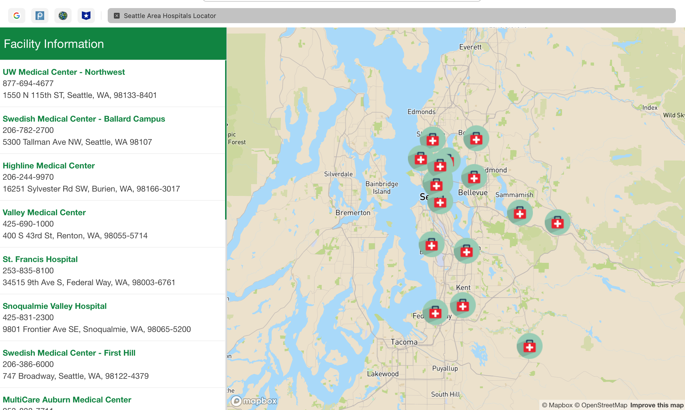
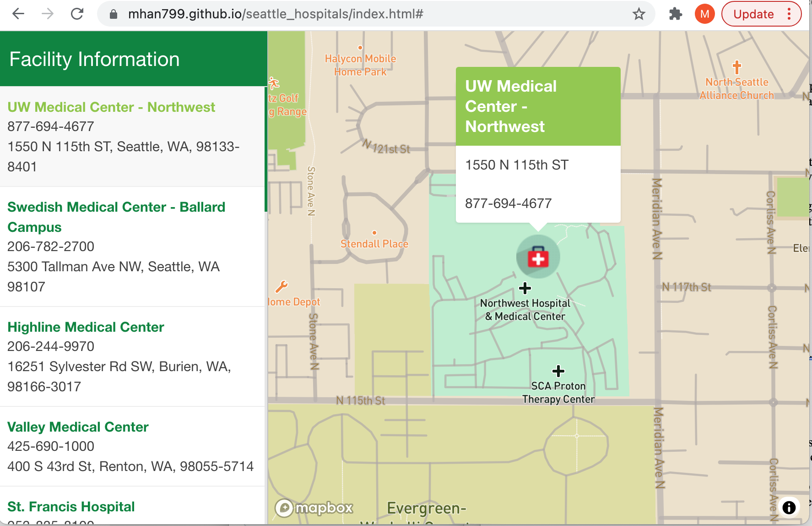
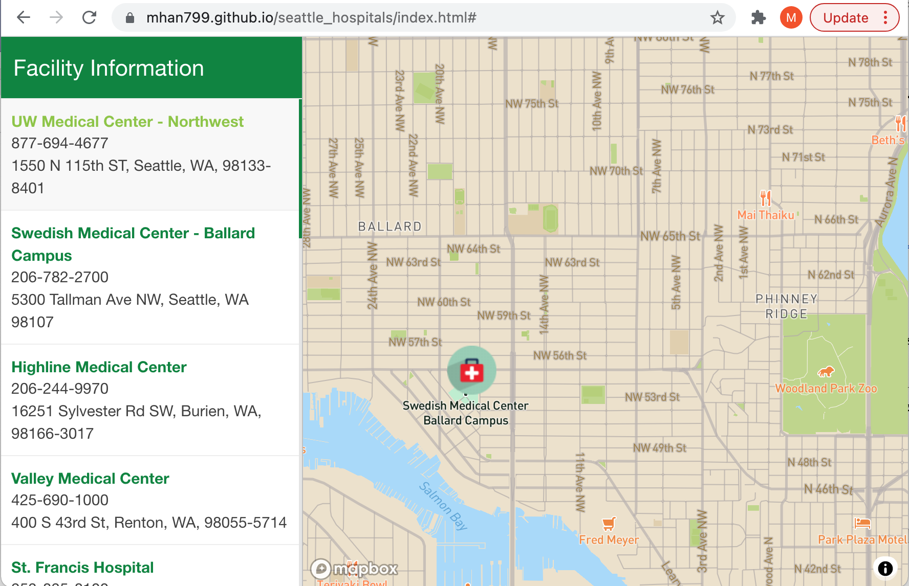

# Seattle Area Hospitals Locator
**Contributor:** Munan Han  
**Course:** GEOG 495 Autumn 2021

## Introduction
During the pandemic of last two years, the whole world had a hard time. In Washington State, there was in total 793,000 cases and 9602 deaths from COVID-19. And in King County, the number of total cases is 176,000 and the number of deaths is 2127, according to the report of [*The NewYork Times*](https://www.nytimes.com/interactive/2021/us/washington-covid-cases.html), updated on December 11, 2021. The health care systems and resources have been greatly impacted. People face a lot more difficulties to the access of medical resources than the time before pandemic. The operation hours for healthcare facilities are change more frequently, and it is more often that the facilities do not have enough capacity for new clients.  Not only the scarce of medical resources and healthcare workers, the epidemic of COVID-19 has also been causing troubles in all aspects of our life, including transportation systems. It is no doubt harder for people to get help for healthcare. The lack of information has become a big problem when people are looking for medical help. Thus, inspired by the module 8 materials, I decided to make an application about the healthcare facilities resources for Seattle area in this final project.

## Description and Goals
This project is designed to be an interactive map application. It is intended to serve as an information guide about each hospital facilities for Seattle residents. The application shows the distribution of hospitals in Seattle area. It also includes basic information of facility name, address, and phone number of the hospitals. This application is aiming to provide simple and informational guide of hospital distributions in Seattle area. It is designed for everyone who has a smart device that can access internet so that the page is designed to be simple and does not require many steps while in using. The users can click and zoom around to get the information that they need. Also, this project uses a basic map design that looks like the map apps that people use every day to get people familiarized with this application. The streets information allows users to make considerations of the geometric distance and the routes to the facilities.

## The Application URL
Here is the url link for the application: [https://mhan799.github.io/seattle_hospitals/index.html](https://mhan799.github.io/seattle_hospitals/index.html)

## Visuals
This is a screenshot of the application.

This is how the application looks like when the user clicks on any one of the facilities on the sidebar as well as how the application looks like when the user clicks on one of the markers in the map. 

The users can also zoom in or out and freely move on the map. The map also includes basic map information of Seattle area for the users to see the routes to the facilities.

## Main Functions
The main functions in this project are: build facilities listing, the interactivity functions, which uses the Mapbox GL JS [flyto]( https://docs.mapbox.com/mapbox-gl-js/api/map/#map#flyto) method to center the map on the user-assigned facility location and zoom in, as well as the Mapbox GL JS [Popup]( https://docs.mapbox.com/mapbox-gl-js/api/markers/#popup) method that displays a popup window at that particular facility location. These functions will be fired when a user click on the facility in the sidebar or on the facility marker in the map. It also included two event listeners for executing the functions when the users click. This project also defined an add markers function to improve the visualization of the map. 

## Data Sources
The primary data source for this project is [Seattle GeoData]( https://data-seattlecitygis.opendata.arcgis.com/), the data file I used is [Hospitals](https://data-seattlecitygis.opendata.arcgis.com/datasets/hospitals/explore), developed by City of Seattle GIS Program, last updated on December 19, 2018. . This file included basic information and the geological distribution of licensed acute care hospitals in the Seattle area. 

## Applied Libraries
- [Mapbox GL JS](https://docs.mapbox.com/mapbox-gl-js/guides/) 
- [Mapbox Studio]( https://docs.mapbox.com/help/glossary/mapbox-studio/)
- [Github](http://github.com)
- [IconArchive]( https://iconarchive.com/)

## Other
This application should only serve as a guide to help people have a quick and easy access to the hospitals of the Seattle area and to get help if non-emergency cases occur, like scheduling an appointment, asking for the operating hours, get medical assistance and advice. If any emergency happens, including but not limited to: heart attack, breathing problems, loss of consciousness, head or spine injury, swallowing a poisonous substance, etc., we recommend calling the ambulance at once.

## Acknowledgment
The author for this project is Munan Han from [GEOG 495](https://data-seattlecitygis.opendata.arcgis.com/datasets/hospitals/explore). This project is drawn from the course materials taught by Professor Bo Zhao, with the help from TA Steven, Xiaoqi Bao. I would like to acknowledge my gratitude for the help and support from them throughout this quarter. They have been dedicating themselves to this course and the students. I have learned so much from them, not only knowledge, but also their intelligence, kindness, and patience. I am happy and honored to be part of this class.
